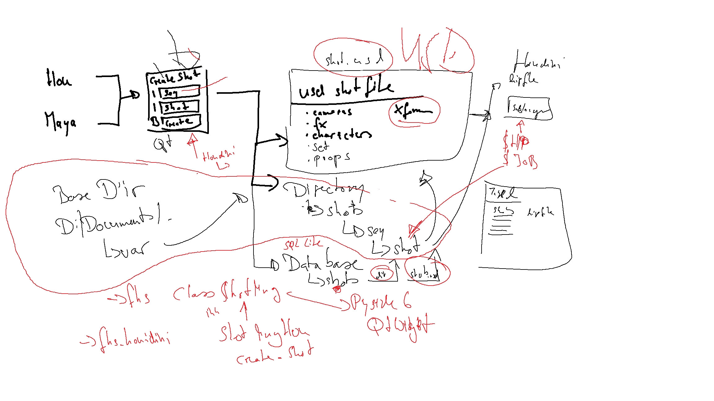

# FHS-Pipeline
Pipeline Repository for the FH Salzburg class Pipeline WS25


## Maya Installation Instruction
To install the toolset for maya create a userSetup.py file in 
`Documents/maya/<version>/scripts` and paste the follow code:

```python
import sys

sys.path.append("D:/Documents/Development/FH_Salzburg/pipeline/python") 
sys.path.append("D:/Documents/Development/FH_Salzburg/pipeline/maya")

from fhs_maya import startUp

startUp.startup()
```
NOTE replace the paths to this directory in sys.path.

## Houdini Installation Instruction
Copy the file houdini/fhs_pipeline.json into the folder:
`Documents/Houdini<version>/packages`
and adjust in the file the line:
```json
  "FHS_PIPELINE": "D:/Documents/Development/FH_Salzburg/pipeline"
```
to the location where this folder is. 

## Dev
Powershell create and source devenv
```powershell
python -m venv .\venv
.\venv\Scripts\Activate.ps1
```
If you get a policy error in PowerShell, run:
```powershell 
Set-ExecutionPolicy -ExecutionPolicy RemoteSigned -Scope CurrentUser
```
